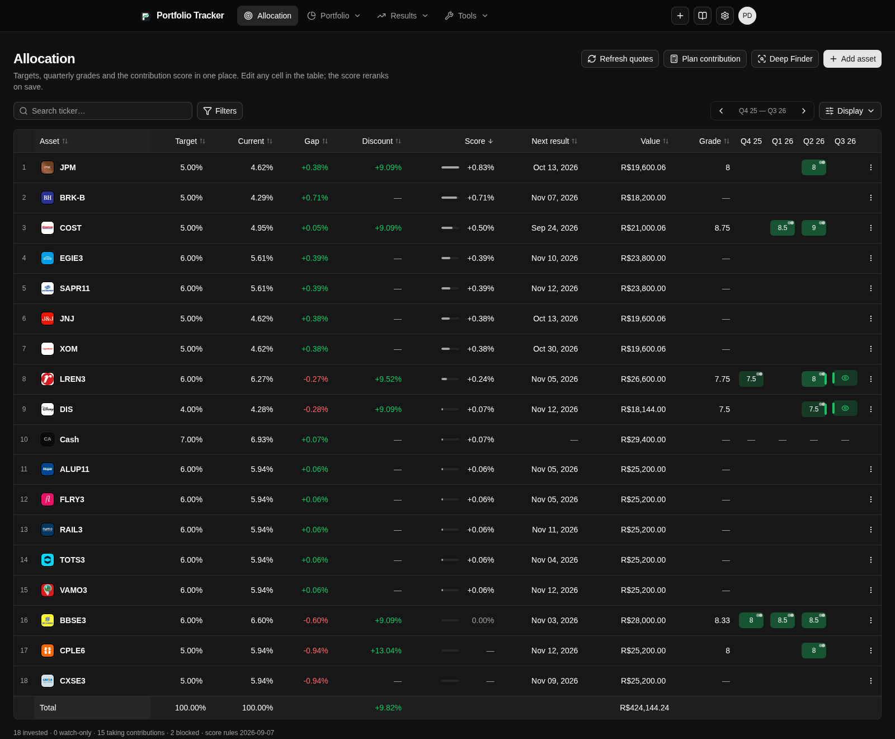
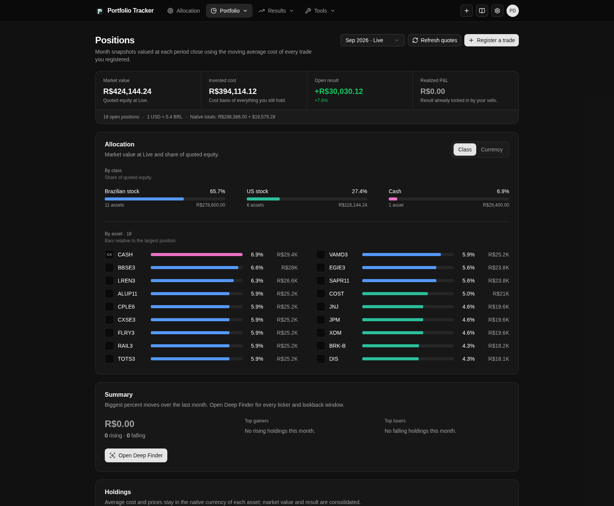
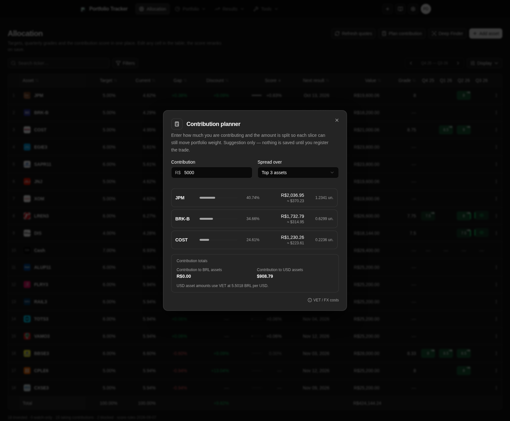

<h1 align="center">Portfolio Tracker</h1>

<p align="center">
  
  
  
  
</p>

<p align="center">
  Track investments, understand portfolio performance, and plan new contributions in one browser-based dashboard.
</p>

Portfolio Tracker records investment transactions and turns them into positions, allocation views, performance summaries, and contribution suggestions. It supports Brazilian and US assets in one account, while keeping each asset's native currency and every calculation traceable to the transaction ledger.

## Explore a portfolio

- **Positions:** review market value, average cost, open results, and the mix of Brazilian and US assets.
- **Allocation:** compare target weights with current holdings, review quarterly grades and fair values, and see which assets are taking contributions.
- **Contribution planning:** rank eligible assets and split a proposed contribution into suggested trade amounts. Nothing is recorded until you register the trades.
- **Goals:** set a monthly income or portfolio value to reach, see when your planned contribution gets there under conservative, base and optimistic real returns, and review how much new money you have added each month.

### Allocation targets and quarterly reviews

<p align="center">
  <a href="assets/screenshots/allocation-table.png"></a>
</p>

### Portfolio overview and contribution planning

<table>
  <tr>
    <th width="50%">Portfolio overview</th>
    <th width="50%">Contribution planner</th>
  </tr>
  <tr>
    <td><a href="assets/screenshots/positions-overview.png"></a></td>
    <td><a href="assets/screenshots/contribution-plan.png"></a></td>
  </tr>
</table>

## Record and review investments

- **Transaction ledger:** record buys and sells for stocks, ETFs, REITs, fixed income, crypto, and other supported assets. Holdings and realized results are derived from transaction history using moving average cost.
- **Broker notes:** import PDF notes from Inter DTVM (B3) and the Apex Clearing and DriveWealth confirmations of Inter's US account. Each note must reconcile with its own totals before its trades are recorded, costs are apportioned to its trades, and its trades can only be removed by deleting the note.
- **Asset research:** set allocation targets and quarterly grades, notes, fair values, and watch-next reminders. Watch-only assets can be tracked without recording a position.
- **Portfolio tools:** explore performance and daily results, review dividends, filter detailed positions, and discover assets through the allocation finder.
- **Multiple currencies:** keep each ticker in its native BRL or USD currency and consolidate the portfolio into the selected display currency with an explicit exchange rate.

## Your data

Account data is stored in PostgreSQL and isolated by authenticated user. Passwords are hashed with scrypt, session cookies contain a random token whose SHA-256 hash is stored by the API, and sessions expire after 30 days. Portfolio backups are account-scoped and never include passwords or sessions.

Money, prices, quantities, rates, percentages, and grades are stored as PostgreSQL `numeric(22, 8)`. Decimal values cross the API as strings; presentation formatting does not change stored values. Quote and FX providers can fail independently, so missing or stale market data remains distinct from a real zero price.

## Market data

Yahoo Finance provides quotes and income data without configuration. Frankfurter is the default source for USD/BRL rates, with BCB PTAX and a manual rate also available. Each trade stores the BCB PTAX of its trade date, so cross-currency cost basis and realized results keep the FX of each purchase; trades without a published rate can be filled later from Transactions. Set `ALPHA_VANTAGE_API_KEY` in `.env` to enrich US dividend data; Yahoo remains the fallback provider.

## Run locally

Use Node.js 24, pnpm, and Docker with PostgreSQL 16. Development reads the local database connection from `.env.development.local`.

```bash
pnpm install
cp .env.example .env.development.local
docker compose up -d
pnpm dev
```

The development command applies pending migrations, then starts the API and web app with hot reload.

- Web app: http://localhost:5173
- API health: http://127.0.0.1:3001/health

## Development

The web app is a React 19 and Vite single-page application. The API uses Hono, tRPC, Drizzle, and PostgreSQL. Shared request and response schemas live in `packages/shared`; portfolio calculations live in `apps/api/src/domain`.

```bash
pnpm typecheck
pnpm lint
pnpm test
pnpm --filter @portifolio-tracker/web i18n:extract
pnpm --filter @portifolio-tracker/web i18n:compile
```

The interface supports English and Brazilian Portuguese. See [AGENTS.md](AGENTS.md) for domain invariants, localization rules, and contribution guidance.
